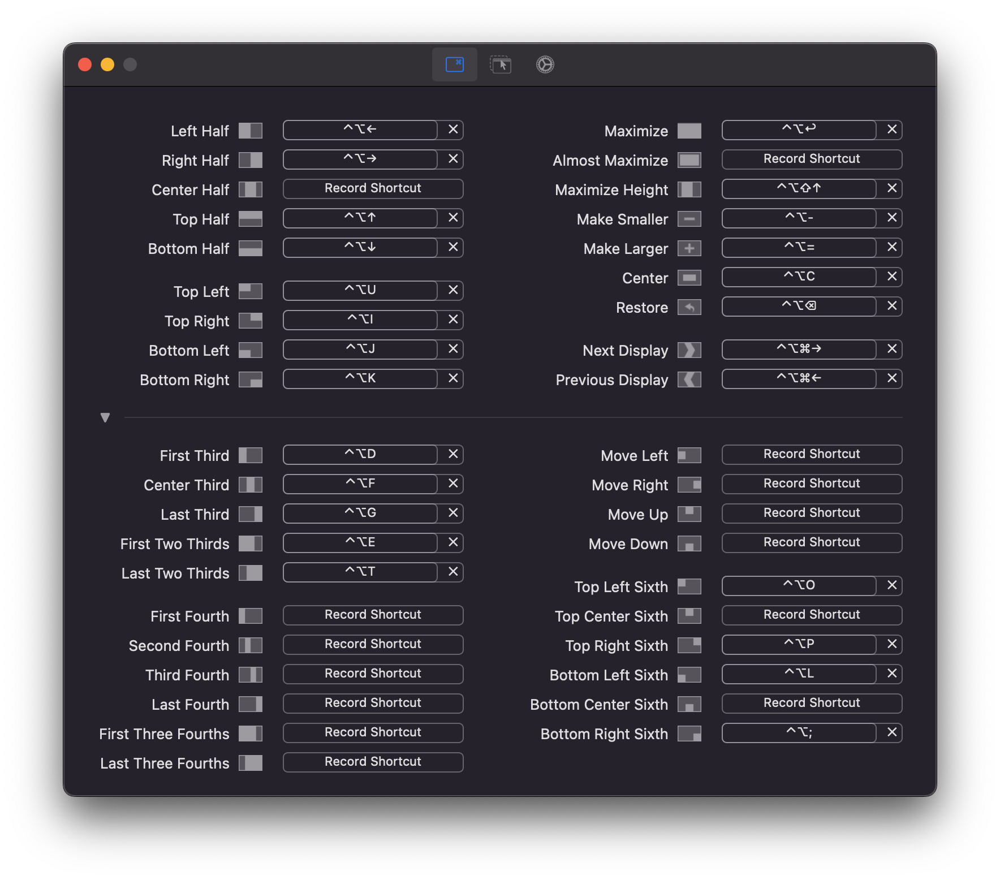

# MacOS

## Context

1. [🔍 Hints](##🔍 Hints)
2. [🦄 Applications](##🦄 Applications)
   1. [Terminal](###Terminal)
   2. [Helpers](###Hlepers)
   3. [Development](###Development)
   4. [Check](###Check)

## 🔍 Hints
- `ctrl` + `r` in Fish shell - search for commands in list view
## 🦄 Applications
### Terminal
- [Homebrew ](https://brew.sh/) - package manager
- [iTerm2](https://iterm2.com/)

> Command: Custom Shell /usr/local/opt/fish/bin/fish
>
> Font: MesloLGS NF Regular 14
>
> Window Appearance: 
>
> ​	Transparency: 18
>
> ​	Blur: 30

- [Fish shell](https://fishshell.com/) - use `./config/fish/config.fish`
- [Fisher](https://github.com/jorgebucaran/fisher) - package manager for fish
- [z for fish](https://github.com/jethrokuan/z) - directory jump
- [eza](https://github.com/eza-community/eza) - beautiful `ls`
- [Nerd fonts](https://github.com/ryanoasis/nerd-fonts) - fonts for terminal themes. I use [MesloLGS NF](https://github.com/IlanCosman/tide)
- [Starship](https://github.com/starship/starship) - default terminal theme, use `./config/starship.toml`
- [yt-dlp](https://formulae.brew.sh/formula/yt-dlp) with [instruction](https://write.corbpie.com/downloading-youtube-videos-and-playlists-with-yt-dlp/)
  Inspired by [developer github](https://github.com/craftzdog/dotfiles-public/tree/master?tab=readme-ov-file)

### Helpers
- [INNA](https://iina.io/) - player
- [Transmission](https://transmissionbt.com/) - torrent client
- [Rectangle](https://rectangleapp.com/) - windows manager

> Gaps between windows: 10px

- Microsoft ToDo - cross-platform todo
- [Obsidian](https://obsidian.md/) | Typora - markdown editors
- [Final Cut Pro](https://rutracker.org/forum/viewtopic.php?t=6419063) - video editing
- [The Unarchiver](https://theunarchiver.com/) - like `7zip` for Windows
- TG Pro - to track RMP of coolers
- [Sideloadly](https://sideloadly.io/) - load test apps on iPhone

### Development
- Xcode 14.3.1 + DevCleaner
- SFSymbols
- Postman
- VS code
- Rider
- [GitHub Desktop](https://desktop.github.com/)
- [Docker](https://www.docker.com/products/docker-desktop/)
- [Dash](https://kapeli.com/dash) - offline documentation viewer
### Check

> ✅ - present in  `applications/check`

- [Coconut battery](https://www.coconut-flavour.com/coconutbattery/) ✅ - check battery health
- [Inspect](https://github.com/mhdhejazi/Inspect) ✅ - check screen and keyboard
- MacsFanControl / [TG Pro](https://www.tunabellysoftware.com/tgpro/) ✅ - check RMP of coolers
- [Heaven benchmark](https://benchmark.unigine.com/heaven) - check temperatures and load
- [Geekbench](https://www.geekbench.com/) - check load
- [DriveDX](https://binaryfruit.com/drivedx) ✅ - check drive health

